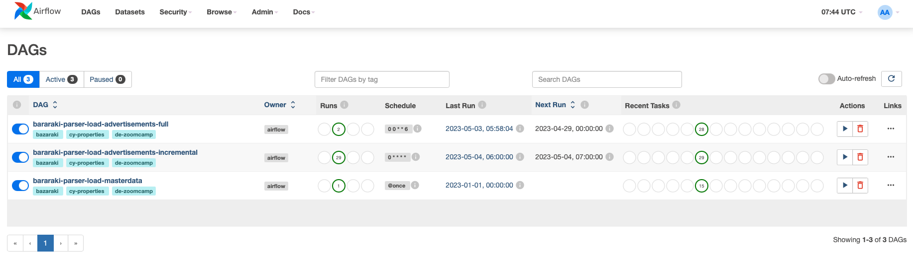

# Course Project: Full data engineering pipeline

## CY Realty Advertisements Parsing

### Problem statement

There is a local Cyprus classified website https://www.bazaraki.com.<br>
It contains advertisements from different categories (Jobs, Electronics, Vehicles, Real Estate, etc).<br>
My goal in this project is to parse Real Estate advertisements, load the data to some storage after preprocessing and visualize the result.<br>
I'm also interested in periodic data update, that's why I parse data on schedule (incremental update every X minutes and full update on a weekly basis).

List of technologies used:
- [Airflow](https://airflow.apache.org) for ETL pipeline scheduling (batch processing)
- [Python](https://www.python.org) as a main programming language for all ETL tasks and Airflow dags
- [Docker & Docker Compose](https://www.docker.com) for reproducibility
- [Google Cloud](http://console.cloud.google.com/) with Cloud Storage for raw parquet files, BigQuery as a Data Warehouse, VM Instance to host Airflow dags and provide ETL execution
- [Terraform](https://www.terraform.io) to automatically configure infrastructure in Google Cloud
- [Looker Data Studio](https://lookerstudio.google.com/navigation/reporting) as a data visualisation tool


The overall pipeline schema could be presented as follows:


Let's briefly describe the pipeline steps:
- Python ETL scripts grab data from website (https://www.bazaraki.com), parse it and store as local .parquet files. There are the following separate  ETL scripts:
  - [ETL-LOAD-MASTERDATA](./parser/src/etl_load_masterdata_from_web_to_parquet.py) loads master data: list of cities, districts, available advertisement categories and so on
  - [ETL-LOAD-ADS](./parser/src/etl_load_ads_from_web_to_parquet.py) loads advertisements and all the related attributes available on the website, saving result to .parquet files also
- All the raw data just parsed are further processed by other Python ETL scripts:
  - [ETL-PROCESS-CITIES-AND-DISTRICTS](./parser/src/etl_process_cities_and_districts.py)
  - [ETL-PROCESS-RUBRICS-AND-FEATURES](./parser/src/etl_process_rubrics_and_features.py)
  - [ETL-PROCESS-ADVERTISEMENTS](./parser/src/etl_process_advertisements.py)
  - [ETL-PROCESS-ADVERTISEMENT-ATTRIBUTES](./parser/src/etl_process_advertisement_attributes.py)
- There is an Airflow responsible not only for ETL scripts scheduling, but also for data movement from local files to GC-Storage, from GC-Storage to BigQuery:
  - [DAG-LOAD-MASTERDATA](./airflow/dags/bazaraki-masterdata-full-update-dag.py) should be triggered once to load master data and create DICT tables 
  - [DAG-ADS-FULL-UPDATE](./airflow/dags/bazaraki-advertising-full-update-dag.py) updates all the advertisements available on a source website
  - [DAG-ADS-INCREMENTAL-UPDATE](./airflow/dags/bazaraki-advertising-incremental-update-dag.py) updates one page every X minutes for every Real Estate subcategory
- DBT [models](./dbt/bazaraki/models) responsible for data transformation in BigQuery are triggered also by Airflow on a regular basis right after new data loading from web 
- Final [dashboard](https://lookerstudio.google.com/reporting/2744708c-a405-4b97-82a6-205c0cd78016/page/ilrND) is aimed to visualize price/popularity relations for different advertisement types for all CY cities 

### Cloud (Google Cloud)

All the jobs are running in Google Cloud VM Instance.<br>
Configuration for Cloud Storage and BigQuery was automated with terraform [config](./terraform/main.tf)

### Data ingestion (Batch Processing)

Airflow was chosen to automate batch data processing.<br>
It was installed from [docker-compose.yaml](./airflow/docker-compose.yaml) official file, where ETL scripts are run as a separate DockerOperators to avoid package conflicts.

### Data warehouse (BigQuery)

BigQuery was chosen as a Data Warehouse. The main pros of it is its easy usage together with Looker Studio.

### Data Transformations (DBT)

Raw data is processed by layers inside BigQuery from external .parquet data files.<br>
DBT was selected as a data transformation tool inside DWH. There are the following [model layers](./dbt/bazaraki/models):
- STG with staging data (materialized tables from external .parquet files)
- Core with staging data processed
- Analytic is a final layer with materialized & processed table used for reporting and analysis

### Dashboard (Looker Studio)

Looker Data Studio was chosen as a reporting tool because it's free, works without installation and could easily be integrated with BigQuery.<br>
Dashboard could be found [here](https://lookerstudio.google.com/reporting/2744708c-a405-4b97-82a6-205c0cd78016/page/ilrND) (public).


### Reproducibility

To reproduce the project launch you should do the following:
- Configure VM Instance on Google Cloud. Login to the instance and clone this repository
- Configure BigQuery dataset and Cloud Storage instance through applying Terraform config:

```shell
# go to terraform folder
cd ./terraform

# initialize terraform
terraform init

# review plan
terraform plan

# apply config
terraform apply
```

- Install docker and docker-compose inside your VM Instance. To avoid access level bug with DockerOperator launching by Airflow do this ([stackoverflow-link](https://stackoverflow.com/questions/62499661/airflow-dockeroperator-fails-with-permission-denied-error)):

```shell
chmod 666 /var/run/docker.sock
```
- Create google service account with access to BigQuery, Cloud Storage and VM Instance. I personally create two separate service accounts (but it's not mandatory, you can use one):
  - first credentials were added [here](./dbt/gcp-credentials-for-gcp) for dbt. Filename `data-engineering-zoomcamp-dbt-keys.json`
  - and [here](./gcp-credentials) for other google cloud services. Filename `gcp-de-zoomcamp-sa.json`
- Add new [firewall rule](https://cloud.google.com/firewall/docs/firewalls) in Google Cloud Network to allow HTTP connections for specific port (`8080` in my case, default for Airflow UI)
- Launch Airflow and check that dags are visible from web interface

```shell
# go to airflow folder
cd ./airflow

# init airflow db
docker-compose up airflow-init

# run all the related containers
docker-compose up -d --build
```

Web interface should look like as follows:



- There are some connections have to be configured inside Airflow:
  - Connection with access to local file system (need for FileSensor operator), connection_id: `local-file-system`
  - Connection with access to Google Services (need for BigQueryOperator), connection_id: `gcp-de-zoomcamp-sa`
- Trigger dag and check the updated Looker Studio [dashboard](https://lookerstudio.google.com/reporting/2744708c-a405-4b97-82a6-205c0cd78016/page/ilrND).
